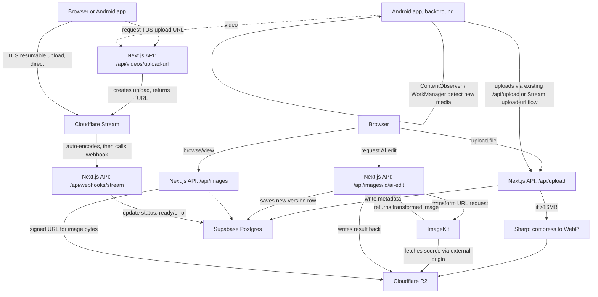

# Architecture

## System Diagram

## Services & Responsibilities

| Service | Responsibility | Explicitly NOT used for |
|---|---|---|
| Cloudflare R2 | Sole storage location for all photo bytes (original + AI-edited variants) | Video storage |
| Sharp (in Next.js API routes) | Server-side photo compression before upload | Client-side compression, any video processing |
| Cloudflare Stream | Video upload, encoding, storage, delivery, thumbnails | Photo storage |
| Supabase | Auth, and metadata only (owner, R2 key or Stream video ID, size/duration, timestamps, relationships between versions) | Storing photo or video bytes |
| ImageKit | On-demand AI transforms (background removal, background redesign, retouch, etc.) via R2 external origin | Primary/long-term storage, general CDN delivery of untouched images, anything video-related |
| Vercel | Hosting Next.js app + API routes | Receiving raw video file bytes (4.5MB request body limit makes this impossible anyway) |
| Capacitor (Android) | Native wrapper around the existing web UI, plus gallery auto-upload | iOS (not yet scoped) |

## Data Flow: Upload
1. User selects file(s) in the browser.
2. Browser sends file to `POST /api/upload` (Next.js API route, `runtime = 'nodejs'`).
3. Route checks file size. If > 16MB, runs it through Sharp (`resize` if needed,
   `.webp({ quality: 80 })`); otherwise normalizes format but skips heavy resizing.
4. Route generates a unique R2 key: `${userId}/${uuid}.webp`.
5. Route uploads the compressed buffer to R2 via `PutObjectCommand`.
6. Route inserts a row into Supabase `images` table: `user_id`, `r2_key`, `original_size`,
   `compressed_size`, `mime_type`, `created_at`.
7. If step 6 fails, the route deletes the just-uploaded R2 object before returning an
   error (avoid orphaned files).
8. Route returns the new image's ID and metadata to the browser.

## Data Flow: AI Edit
1. User selects a photo and requests an AI edit (e.g. background removal).
2. Browser calls `POST /api/images/[id]/ai-edit` with the desired transform type.
3. Route looks up the image's `r2_key` in Supabase, confirms it belongs to the
   requesting user.
4. Route builds an ImageKit transformation URL pointing at the R2 external origin
   with the requested transform (e.g. `tr:e-bgremove`).
5. Route fetches the transformed image from ImageKit.
6. Route uploads the result to R2 under a new key (e.g. `${userId}/${uuid}-edited.webp`).
7. Route inserts a new `images` row (or an `image_versions` row — see schema) linking
   it to the original.
8. Route returns the new image's ID/URL to the browser.

## Data Flow: Browse/View
1. Browser calls `GET /api/images` (paginated, scoped to the authenticated user via
   Supabase RLS).
2. Route returns metadata rows plus a signed R2 URL (short-lived) for each thumbnail
   and/or full image, generated via the S3 SDK's `getSignedUrl`.
3. Browser renders the grid using the signed URLs. URLs are not cached long-term
   client-side since they expire.

## Data Flow: Video Upload (Phase 2)
1. User selects a video in the browser or the Android app requests upload on the
   user's behalf (auto-upload path).
2. Client calls `POST /api/videos/upload-url`. This route is small and fast — it
   never touches the video's bytes, only asks Cloudflare Stream to create an
   upload and returns Stream's TUS endpoint URL, passing `creator: userId` so
   Stream tracks ownership on its side too.
3. Client uploads the video directly to Cloudflare Stream over TUS (resumable —
   survives a dropped mobile connection and resumes rather than restarting).
4. Route inserts a `videos` row in Supabase with `status = 'pending'` and the
   Stream video ID, before the upload even finishes, so the UI can immediately
   show a "processing" placeholder.
5. Cloudflare Stream encodes the video automatically (free, async, multiple
   bitrates) — nothing in this app's infrastructure does any transcoding work.
6. When encoding finishes (or fails), Stream calls `POST /api/webhooks/stream`.
7. The webhook handler verifies Cloudflare's webhook signature, then updates the
   matching `videos` row: `status = 'ready'` (with `ready_at` set) or
   `status = 'error'` (with `error_message` set).
8. The browser reflects the status change — either via a lightweight poll of
   `/api/videos` or, if wired up, a Supabase Realtime subscription on the
   `videos` table, so the UI updates without a manual refresh.
9. Playback requests a signed Stream URL server-side (never expose the raw
   Stream video ID as a public playback URL without signing, since this is
   private personal video, not public content).

## Android App Architecture (Phase 2)
The Android app is **not a separate codebase** — it's the existing Next.js/React
frontend wrapped in Capacitor, plus one native addition: background gallery sync.

- **`ContentObserver`** registered on `MediaStore.Images.Media.EXTERNAL_CONTENT_URI`
  (and the video equivalent) fires immediately when a new photo/video is written
  to the gallery, but only while the app process is alive (foreground or recently
  backgrounded).
- **`WorkManager`** periodic job is the catch-all for when the app isn't running:
  queries `MediaStore` for anything added since the last synced timestamp (stored
  locally), and uploads it via the same API routes as the web app — photos to
  `/api/upload`, videos to `/api/videos/upload-url`. Android enforces a **~15-minute
  minimum interval** for periodic background work; this cannot be shortened.
- **Local dedupe table** (device-local, e.g. Room or SharedPreferences) tracks
  which media URIs have already been uploaded, so the `ContentObserver` and
  `WorkManager` paths never double-upload the same item.
- **Permissions**: `READ_MEDIA_IMAGES` / `READ_MEDIA_VIDEO` (Android 13+) requested
  at runtime. A foreground-service notification is required if the app wants more
  reliable sync timing than `WorkManager` alone provides.
- **Constraints**: uploads should default to a `NetworkType.UNMETERED` (Wi-Fi only)
  constraint on the `WorkManager` request, with a user-facing toggle to allow
  mobile data if they want it.

## Database Schema Summary
See `supabase/schema.sql` for the full definition. Core tables:
- `images` — one row per stored photo (original or AI-edited), with
  `parent_image_id` nullable self-reference for edited versions. Bytes live in R2.
- `videos` — one row per stored video, holding the Cloudflare Stream video ID and
  a `status` (`pending`/`processing`/`ready`/`error`). Bytes live in Cloudflare
  Stream, never in R2 or Supabase.
- RLS policies on both tables restrict all reads/writes to `auth.uid() = user_id`.

## API Routes

| Route | Method | Purpose |
|---|---|---|
| `/api/upload` | POST | Compress + upload new image, write metadata |
| `/api/images` | GET | List current user's images (paginated) |
| `/api/images/[id]` | GET | Get single image metadata + signed URL |
| `/api/images/[id]` | DELETE | Delete image from R2 + Supabase |
| `/api/images/[id]/ai-edit` | POST | Run an AI transform via ImageKit, save result |
| `/api/images/[id]/download` | GET | Return a signed download URL |
| `/api/videos/upload-url` | POST | Create a Cloudflare Stream TUS upload, return the URL, write the initial `pending` row |
| `/api/videos` | GET | List current user's videos (paginated) |
| `/api/videos/[id]` | GET | Get single video metadata + signed playback URL |
| `/api/videos/[id]` | DELETE | Delete video from Cloudflare Stream + Supabase |
| `/api/webhooks/stream` | POST | Cloudflare Stream calls this on encode complete/error; verifies signature, updates status |

## Security Model
- R2 bucket is **private**. All access to image bytes goes through short-lived signed
  URLs generated server-side, never a public bucket URL.
- Supabase RLS is the enforced access boundary — every table policy checks
  `auth.uid() = user_id`.
- `SUPABASE_SERVICE_ROLE_KEY` (bypasses RLS) is used only in trusted server contexts
  (e.g. the upload route needs to insert on behalf of the authenticated user) — never
  sent to the client.
- ImageKit's external-origin fetch to R2 should be restricted (ImageKit access
  restrictions / R2 bucket policy) so only ImageKit's fetcher can read from the
  bucket over that path if the bucket ever needs public-read for that origin —
  confirm against current ImageKit external-origin auth options before launch.
- The Cloudflare Stream webhook endpoint (`/api/webhooks/stream`) must verify the
  request's signature against the webhook secret before trusting its payload —
  never update a video's status based on an unverified POST to that route.
- Video playback uses Stream's own signed-URL mechanism, generated server-side,
  the same trust model as R2's signed URLs for photos.
- The Android app's `WorkManager`/`ContentObserver` upload path authenticates as
  the logged-in user the same way the web app does (Supabase session token) — it
  is not a separate trust boundary, just a different client.

## Cost-Relevant Design Decisions (for reference)
- Storage lives only in R2 to avoid paying for the same bytes twice across R2 and
  ImageKit.
- Compression happens before storage, not on every read, to keep R2 storage costs
  down and avoid repeated CPU cost on Vercel.
- AI transforms are requested on-demand rather than pre-generated for every photo,
  since ImageKit's extension-unit pricing is metered per operation.
